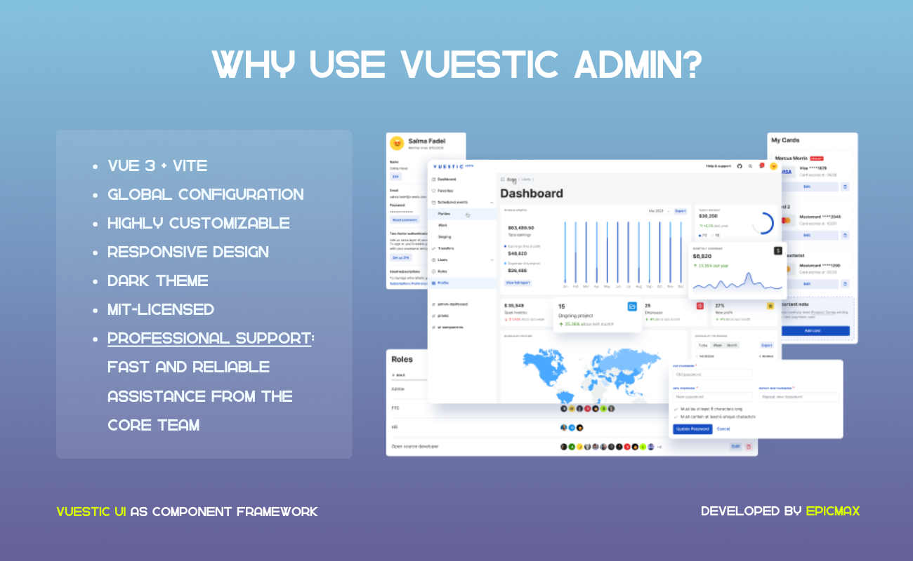

<p align="center">
  <a href="https://vuestic.dev" target="_blank">
    
  </a>
</p>

<p align="center">
  Free and beautiful Admin Template utilizing Vue 3, Vite, Pinia, and Tailwind CSS. Designed for building efficient, responsive, and fast-loading admin interfaces.</br>
  Developed by  <a href="https://epicmax.co">Epicmax</a>.</br>
  Based on <a href="https://ui.vuestic.dev">Vuestic UI</a> library.
</p>

<p align="center">
  <a href="https://admin-demo.vuestic.dev"> Live Demo </a> |
  <a href="https://admin.vuestic.dev/"> About Vuestic Admin </a> |
  <a href="https://ui.vuestic.dev/">Vuestic UI documentation</a>
</p>

> Vuestic Admin is built with [Vuestic UI](https://ui.vuestic.dev). See our
> <a href="https://github.com/epicmaxco/vuestic-ui/issues">issues</a>,
> <a href="https://ui.vuestic.dev/en/contribution/guide">contributing guide</a> and join discussions on our
> <a href="https://discord.gg/jTKTjj2weV">Discord server</a> to help us improve Vuestic Admin & Vuestic UI experience.

<p align="center">
  <a href="https://admin.vuestic.dev" target="_blank">
    
  </a>
</p>

### Quick start

Use following command to quickly scaffold new [Vuestic Admin](https://admin-demo.vuestic.dev) or empty Vite or Nuxt project with [Vuestic UI](https://ui.vuestic.dev).

```bash
npm create vuestic@latest
```

After [Vuestic Admin](https://admin.vuestic.dev) is installed, run `npm install` to install dependcies, then run `npm run dev` to start local development server.

### Documentation

Documentation, guides, examples and tutorials are available on [ui.vuestic.dev](https://ui.vuestic.dev)

### Official Discord Server

Ask questions at the official community [discord server](https://discord.gg/jTKTjj2weV)

### Features

- **Vue 3, Vite, Pinia, and Tailwind CSS -** Fast and efficient development
- **Dark Theme -** Modern and eye-catching
- **Global Configuration -** Effortless customization
- **Accessibility -** Inclusive and user-friendly
- **i18n Integration -** Easy localization for global reach
- **Educational Resource -** Ideal for learning and improving skills
- **Responsive Design -** Adapts seamlessly to all devices
- **Professional Support -** Reliable help from the experts
- **Highly Customizable -** Tailor to your project's style

### Contributing

Thanks for all your wonderful PRs, issues and ideas.

<a href="https://github.com/epicmaxco/vuestic-admin/graphs/contributors">

</a>
<br>

You're always welcome to join: check out
our <a href="https://ui.vuestic.dev/en/contribution/guide">
contribution guides</a>
, [open issues](https://github.com/epicmaxco/vuestic-ui/issues)
and [Discord server](https://discord.gg/jTKTjj2weV)

### Partners & Sponsors ❤️


Become a partner: [hello@epicmax.co](mailto:hello@epicmax.co)

### Can I hire you guys?

[Epicmax](https://epicmax.co) is committed to Open Source from its beginning. Vuestic Admin was created and backed by Epicmax, and is supported through all the years.

With 6+ years of dedicated work on both commercial and open-source projects, and more than 47 clients worldwide across various fields, Epicmax has deep expertise in frontend development, especially in Vue.js. We regularly conduct code audits for our projects and now excited to offer this service not only to our existing clients but to anyone looking to understand the state of their frontend code and ensure it's secure and up-to-date!

You can request a consultation or order web development services by Epicmax via this [form](https://epicmax.co/contacts) 😎

Say hi: <a href="mailto:hello@epicmax.co">hello@epicmax.co</a>. We will be happy to work with you!

[Other work](https://epicmax.co) we've done 🤘

[Meet the Team](https://ui.vuestic.dev/introduction/team)

### Awards

<a href="https://flatlogic.com/templates/vuestic-vue-free-admin" target="_blank">
    
</a>
<p>
  By <a href="https://flatlogic.com/templates/vuestic-vue-free-admin" target="_blank">@flatlogic</a> marketplace
</p>

### Premium Support and Consulting

Get Premium Support & Consulting services through our official development partner, Epicmax. As the main contributor to Vuestic UI and Vuestic Admin, Epicmax brings a wealth of expertise and experience to help you achieve your project goals efficiently and effectively.

[Get a quote](https://www.epicmax.co/?ref=vuestic-consulting)

### Follow us

Stay up to date with the latest Vuestic news! Follow us
on [Twitter](https://twitter.com/vuestic_ui)
or [Linkedin](https://www.linkedin.com/company/18509340)

### License

[MIT](https://github.com/epicmaxco/vuestic-admin/blob/master/LICENSE) license.

## Déploiement sur VPS

### Prérequis

- Un VPS avec Ubuntu 20.04 ou plus récent
- Node.js (v16+) et npm installés sur le VPS
- PM2 installé globalement (`npm install -g pm2`)
- Git installé sur le VPS
- Un accès SSH au VPS
- MySQL installé et configuré sur le VPS

### Étapes de déploiement manuel

1. **Cloner le dépôt sur votre VPS**

   ```bash
   git clone https://github.com/votre-username/lounge_dashboard.git
   cd lounge_dashboard
   ```

2. **Installer les dépendances et construire l'API**

   ```bash
   cd backend
   npm install
   npm run build
   ```

3. **Configurer les variables d'environnement**

   - Créez un fichier `.env` dans le dossier `backend` avec les variables nécessaires ou utilisez celles définies dans `ecosystem.config.js`

4. **Démarrer l'API avec PM2**

   ```bash
   cd ..  # Retour au dossier principal
   pm2 start ecosystem.config.js --env production
   ```

5. **Vérifier que l'API fonctionne**

   ```bash
   pm2 status
   curl http://localhost:6610/api/health
   ```

6. **Configurer un redémarrage automatique au démarrage du système**
   ```bash
   pm2 startup
   pm2 save
   ```

### Déploiement automatisé avec PM2 deploy

1. **Configurer votre clé SSH pour accéder au VPS**
   Assurez-vous que votre clé SSH est configurée correctement pour se connecter à votre VPS.

2. **Personnaliser le fichier ecosystem.config.js**
   Modifiez les paramètres suivants dans le fichier `ecosystem.config.js` :

   - `user`: Votre nom d'utilisateur SSH
   - `host`: L'adresse IP ou le nom d'hôte de votre VPS
   - `repo`: URL de votre dépôt git
   - `path`: Chemin où déployer sur le serveur
   - variables d'environnement dans la section `env`

3. **Configurer le serveur de déploiement (première fois uniquement)**

   ```bash
   pm2 deploy ecosystem.config.js production setup
   ```

4. **Déployer l'application**

   ```bash
   pm2 deploy ecosystem.config.js production
   ```

5. **En cas de mise à jour ultérieure**
   Il suffit de relancer la commande de déploiement :
   ```bash
   pm2 deploy ecosystem.config.js production
   ```

### Configuration de Nginx (Recommandé)

Pour exposer votre API sur le web, configurez Nginx comme proxy inverse :

1. **Installer Nginx**

   ```bash
   sudo apt update
   sudo apt install nginx
   ```

2. **Créer une configuration de site pour votre API**

   ```bash
   sudo nano /etc/nginx/sites-available/lounge-api
   ```

3. **Ajouter la configuration suivante**

   ```nginx
   server {
       listen 80;
       server_name api.votredomaine.com;  # Remplacez par votre nom de domaine ou IP

       location / {
           proxy_pass http://localhost:6610;
           proxy_http_version 1.1;
           proxy_set_header Upgrade $http_upgrade;
           proxy_set_header Connection 'upgrade';
           proxy_set_header Host $host;
           proxy_cache_bypass $http_upgrade;
       }
   }
   ```

4. **Activer le site et redémarrer Nginx**

   ```bash
   sudo ln -s /etc/nginx/sites-available/lounge-api /etc/nginx/sites-enabled/
   sudo nginx -t
   sudo systemctl restart nginx
   ```

5. **Configurer HTTPS (optionnel mais recommandé)**
   Utilisez Certbot pour obtenir un certificat SSL gratuit :
   ```bash
   sudo apt install certbot python3-certbot-nginx
   sudo certbot --nginx -d api.votredomaine.com
   ```
